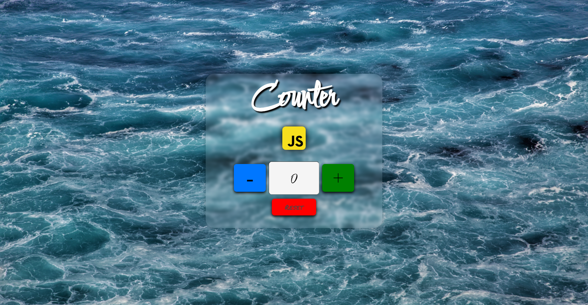
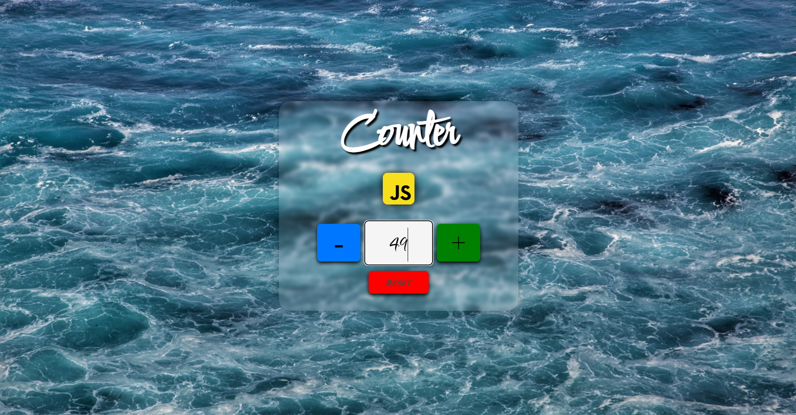

# Counter

<!--
*** Thanks for checking out the Best-README-Template. If you have a suggestion
*** that would make this better, please fork the repo and create a pull request
*** or simply open an issue with the tag "enhancement".
*** Don't forget to give the project a star!
*** Thanks again! Now go create something AMAZING! :D
-->

<!-- PROJECT LOGO -->
 

  

<!-- TABLE OF CONTENTS -->

  
Table of Contents

  <ol>
    <li>
      <a href="#about-the-project">About The Project</a>
      <ul>
        <li><a href="#built-with">Built With</a></li>
      </ul>
    </li>
    <li><a href="#usage">Usage</a></li>
    <li><a href="#contact">Contact</a></li>
  </ol>

<!-- ABOUT THE PROJECT -->
## About The Project

</img>

Il Counter è stato sviluppato implementando in JavaScript sia i 3 pulsanti ("+", "-", "Reset"), sia la visualizzazione del valore. L'app è "Responsive" e quindi accessibile in versione mobile, tablet e desktop. 

(<a href="#top">back to top</a>)

### Built With

* HTML
* CSS
* JavaScript

(<a href="#top">back to top</a>)

<!-- USAGE EXAMPLES -->
## Usage

Il Counter dispone di 3 pulsanti: "+" (incremento), "-" (decremento), "Reset".
Inoltre è possibile digitare la cifra desiderata all'interno del riquadro principale e utilizzare poi i pulsanti sopra elencati per modificare il valore del counter.

</img>

(<a href="#top">back to top</a>)

<!-- CONTACT -->
## Contact

Mario Malitesta - mario.malitesta@gmail.com

Project Link: [https://github.com/Mario3999/Counter](https://github.com/Mario3999/Counter)

(<a href="#top">back to top</a>)

